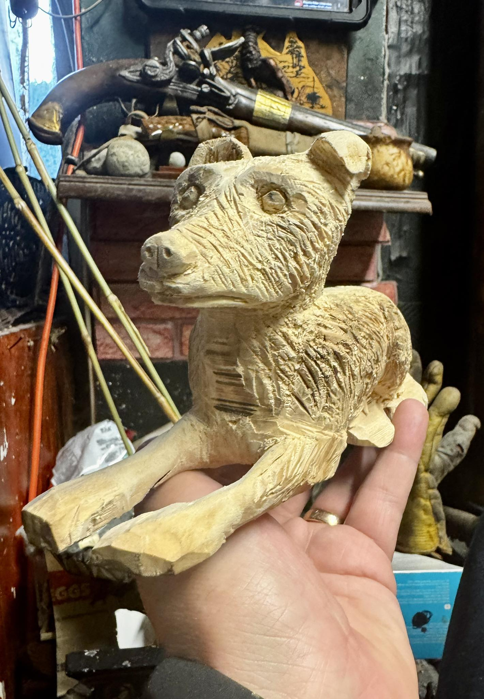
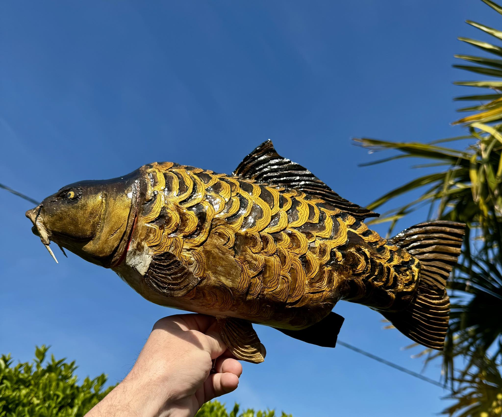

# Facebook Content Integration Plan for Lancaster Carving Limited

## Overview
This plan details how to integrate selected Facebook posts (text and images) into the Lancaster Carving Limited website, excluding the blog section. All referenced images will be placed in the `public/` folder. 

**Contact Information (to be updated across the website):**
- Email: riverdeechris@gmail.com
- WhatsApp: +44 7915 998923
- Location: Institute lane, Mold, United Kingdom
- YouTube: https://youtube.com/@christianlancastersculptur8147

**Image Integration Note:**
- Additional images in the `public/` folder can be included throughout the site. Use descriptive filenames for context (e.g., `FishAndInsectOnTop.jpg`, `MeHoldingAFish.jpg`, etc.).

---

## 1. Homepage
**Section:** Social Highlights / Latest from Facebook
- **Placement:** After the Testimonials section or before the final Call-to-Action.
- **Content:**
  - "Good Afternoon 🌞 My Barn Owls back 😜 ❤️🔪🦉"  
    
  - "When the sun sets gold...A new beginning begins to unfold ❤️🔪🦉"  
    
  - "I became insane, with long intervals of horrible sanity. - EDGAR ALLAN POE ❤️🔪🐦‍⬛"  
    

---

## 2. Portfolio
**Section:** Recent Works / Behind the Scenes
- **Placement:** After the Portfolio Statistics or as a new grid row.
- **Content:**
  - "Good morning 🌞 If you always keep the sun on your face..."  
    
  - "Good morning 🌞 I haven’t had much time to carve lately..."  
    
  - "Good afternoon 🌞 I will be starting a big pike carving tomorrow..."  
    
  - "Wip I’m finishing the final shaping on Frank..."  
    
  - "Good morning 🌞 I’m finishing my latest 40 cm fully plated mirror carp..."  
    

---

## 3. About
**Section:** Community & Inspiration
- **Placement:** After the Workshop Tools Gallery or as a sidebar/feature box.
- **Content:**
  - "It’s true what they say God takes the best first. This poem is for my beautiful cousin Hayley..."  
    
  - Poem: "A flower of the moon...With the wind and sun in your hair"

---

## 4. Testimonials / Inspiration
**Section:** Inspirational Messages
- **Placement:** As a rotating quote or small card in the Testimonials section.
- **Content:**
  - "Good morning 🌞 In a world where you can be anything you want to be Be kind ❤️🐝🐝"  
    

---

## 5. Footer or Sidebar (Optional)
**Section:** Facebook Feed Preview
- **Placement:** Small widget or image/text preview in the footer or sidebar.
- **Content:**
  - Rotating or static display of the above posts/images.

---

## Notes
- All images should be placed in the `public/` folder and referenced by their filename.
- Text can be displayed as captions, overlays, or in cards, matching the site’s visual style.
- For accessibility, add `alt` text to all images.
- Posts can be updated or rotated periodically for freshness.

---

**Prepared for:** Lancaster Carving Limited
**Date:** July 4, 2025
